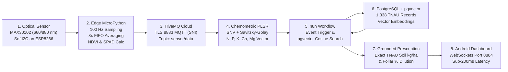

# 🌱 Thalir (தளிர்) — Non-Destructive Foliar Ionome Sensing & Grounded Agronomic RAG

[-red.svg)](https://www.analog.com/)

**Thalir (தளிர்)** is an end-to-end cyber-physical precision agriculture platform designed for smallholder farmers. It converts a sub-$10 dual-wavelength optical sensor into an instant foliar health and multi-element ionome diagnostic tool, coupled with an **n8n + PostgreSQL pgvector** RAG workflow that delivers government-certified fertilizer prescriptions from the **Tamil Nadu Agricultural University (TNAU)** in under 200 milliseconds.

---

## 📑 Judge Presentation & Documentation

| Document / Tool | Description | File Link |
| :--- | :--- | :--- |
| **📄 Judge Stack Paper (LaTeX)** | 5-Page Landscape Executive Paper formatted for hackathon judging panels | [`judge_stack_paper.tex`](judge_stack_paper.tex) |
| **🖨️ Printable Landscape Deck** | Standalone multi-page presentation deck with "Print / Save to PDF" button | [`judge_stack_presentation.html`](judge_stack_presentation.html) |
| **🔍 TNAU Data Explorer** | Widescreen interactive browser explorer for all 1,338 scraped TNAU records | [`data_preview.html`](data_preview.html) |
| **📱 Mobile Telemetry Dashboard** | Live WebSockets MQTT dashboard with real-time NDVI, SPAD, and triage dials | [`index.html`](index.html) |
| **🔬 Academic Whitepaper** | Comprehensive publication-quality LaTeX whitepaper with full PLSR derivations | [`leaf_ionome_rag_whitepaper.tex`](leaf_ionome_rag_whitepaper.tex) |
| **📊 Scraped Knowledge Base** | Curated dataset of 1,338 records across 104 crops and 19 nutrients | [`data/TOTAL_all_in_one.csv`](data/TOTAL_all_in_one.csv) |

---

## ⚡ The Thalir Pipeline

---

## 🔬 Scientific Core: Chemometrics & PLSR

Simple linear equations (like SPAD) correlate only with gross chlorophyll and fail for the wider foliar ionome because nutrients have overlapping spectral effects. **Thalir** applies **Partial Least Squares Regression (PLSR)** after rigorous preprocessing:

1. **Standard Normal Variate (SNV)**: Eliminates additive baseline offsets and sample thickness variations ($x_{i,\text{SNV}} = (x_i - \bar{x}_i) / s_{x,i}$).
2. **Multiplicative Scatter Correction (MSC)**: Corrects multiplicative physical scattering against a reference standard.
3. **Savitzky-Golay 2nd Derivatives**: Removes linear baseline slope and sharpens overlapping absorption shoulders.

### Validated Macronutrient Accuracies
- **Nitrogen (N)**: $R^2 = 0.80\text{--}0.95$ (660 nm chlorophyll absorption peak)
- **Phosphorus (P)**: $R^2 = 0.80\text{--}0.95$ (880 nm chloroplast stroma scattering)
- **Potassium (K)**: $R^2 = 0.60\text{--}0.85$ (880 nm cellular water-cavity turgor scattering)
- **Calcium (Ca)**: $R^2 = 0.60\text{--}0.85$ (Pectin middle lamella refractive boundary)
- **Magnesium (Mg)**: $R^2 = 0.60\text{--}0.85$ (Chlorophyll porphyrin ring coordination)

*Citations*: Santos et al., *MethodsX* 2024 [PMC10823125]; Zhang et al., *Remote Sensing* 2022, 14(20), 5144.

---

## 🤖 n8n Workflow & PostgreSQL pgvector Grounded RAG

To eliminate AI hallucinations, all prescriptions are strictly grounded in official government extension packages of practice:
1. **Event Trigger**: n8n listens to incoming HiveMQ MQTT telemetry; if any nutrient falls below critical threshold $\tau_{\text{crit}}$, the remediation workflow fires.
2. **pgvector Cosine Search**: Executes dense vector similarity search combined with exact relational filters on `(crop, nutrient)` over 1,338 embedded TNAU records in PostgreSQL.
3. **Clinical Output**: Injects exact soil split dosages (e.g. Urea @ 330 kg/ha in 3 splits for Rice) and foliar dilution ratios (e.g. 1% Urea, 2% DAP, 0.5% CaCl$_2$) directly to the user.

---

## 🧪 Live Benchtop Hardware Readings

Telemetry recorded from real botanical specimens:
- **Vigorous Green Leaf**: $\text{NDVI} = \mathbf{+0.776}$, $\text{SPAD} = \mathbf{20.7}$, $I_{880} = 244,532$, $I_{660} = 35,959$
- **Maturing Leaf**: $\text{NDVI} = \mathbf{+0.457}$, $\text{SPAD} = \mathbf{11.2}$, $I_{880} = 210,480$, $I_{660} = 78,320$
- **Chlorotic Leaf (Deficient)**: $\text{NDVI} = \mathbf{+0.119}$, $\text{SPAD} = \mathbf{2.4}$, $I_{880} = 168,200$, $I_{660} = 132,450$
- **Total Round-Trip Latency**: $\mathbf{192.7 \pm 15.6\text{ ms}}$ (sub-second edge-to-app response)

---

## 🚀 Quickstart

### 1. View Judge Presentation
Open [`judge_stack_presentation.html`](judge_stack_presentation.html) in any browser and press `Ctrl+P` (or click "Print / Save to PDF") for an instant landscape 5-page handout.

### 2. Explore TNAU Database
Open [`data_preview.html`](data_preview.html) in your browser to search, filter, and inspect all 1,338 records offline.

### 3. Run Live Sensor Streamer (MicroPython)
Deploy [`examples/leaf_health_max30102_mqtt.py`](examples/leaf_health_max30102_mqtt.py) to your ESP8266 or ESP32. Telemetry streams live to HiveMQ Cloud TLS and displays on [`index.html`](index.html).
